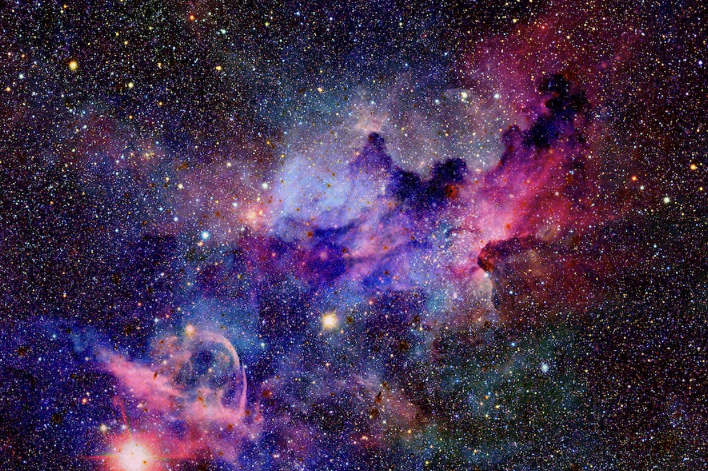

# 2035

这是一部以开源方式创作的第一部小说，这部小说将会以非常硬核(hard-core)的方式，即基于经过验证的科学理论和工程技术来预测我们在2035年及以后的生活方式。这不是一部玄幻的小说，而是我希望基于合理的推论和大胆的想象可以为我们人类生活方式的提供更多的可能性。

## 为什么选择开源的方式创作？

首先，在开源社区中存在着大量的工程师和科学家，这是一群非常理性而且有坚实工程实践经验和开阔的理论视野的人。我相信我们的未来如何发展，这些人会起到决定性的作用。因而，这群人如何看待未来，将决定我们的未来生活的样貌。那为什么我们不能通过大胆的想象和坚实的逻辑推论来一起定义我们的未来呢？

第二， 传统的小说都是由小说家来创作，情感性足够，但是对于科学和技术的理解上却和主流科学界相去甚远。 当然，少数工程师或科学家也成为了小说的创作者，但是也是势单力薄，很难有史诗级的创作。

基于以上两点，我创作了这个开源项目，让我们一起来畅想未来的*技术发展*、*生活方式*和*社会结构的变迁*，对于我们创作来说也是一次心灵的激荡。如果在未来我们的工作中能起到一些启发或者帮助，来一起创造出更多的技术产品和科学理论，那就更棒了。

## 故事线模式

2035的项目计划以POV(Point Of View)方式来展开故事线。如果你对POV展开故事线的写作方式不熟悉，可以参考wikipedia的[POV](https://en.wikipedia.org/wiki/Narration#Narrative_point_of_view)介绍。

## 主要人物

| 人物名称 | 星球   | 居住地    | 职业                           | 生物身份     |
| -------- | ------ | --------- | ------------------------------ | ------------ |
| 顾祝全   | 地球   | 北京      | 机械工程师                     | 人类         |
| 王蓓     | 火星   | Base Main | 全息AR调教师                   | 增强型阿尔法 |
| Bryan    | 地球   | Huston    | Space Center空天防御系统工程师 | 人类         |
| Onkel G  | Europa | 1437ß     | 移民所负责人                   | 增强型贝塔   |
|          |        |           |                                |              |

## 多语言计划

我希望首先是支持中文和英文，这两种语言会覆盖全球很大一部分读者和创作者，如果你愿意贡献你的语言，我非常欢迎你参与本地化工作。 

## gitbook地址
https://hui-h-zhao.gitbook.io/2035/readme

